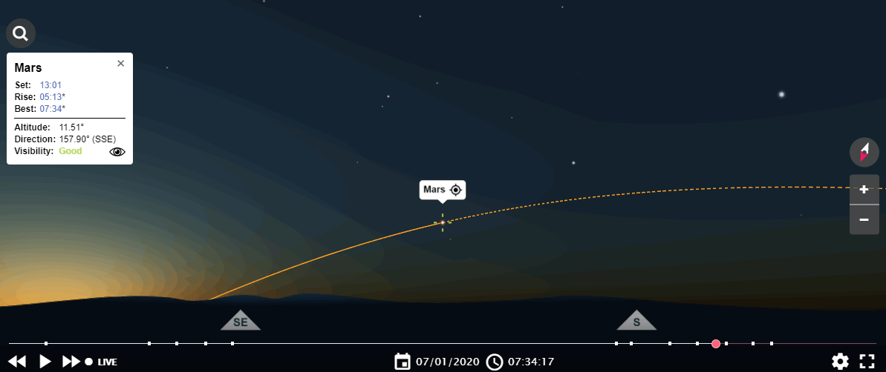

# Mars

[Billedet er fra TimeAndDate](https://www.timeanddate.com/astronomy/night/denmark/copenhagen)

## Kort om Mars

[Billedet er fra WikiPedia](https://commons.wikimedia.org/wiki/Mars#/media/File:Mars_transparent.png)

- Placeret efter jorden
  - ca 250.000.000 km fra solen +/- (jorden er ca 150.000.000 km fra solen +/-)
    - 100 år med 100 km/t
- Størrelsen er omkring 50% af jorden
- Tyngdekraft ca 1/3 af jordens
- Temperatur på overfladen er i gns -60 grader (min -140 max 20)
- Næsten ingen atmosfære
- Masser af ekspeditioner til Mars
  - pt 2 robotbiler og flere laboratorier i kredsløb
  - en masse snak om kommende misioner til Mars - med både robotter og mennesker
    - [Mars 2020](https://www.jpl.nasa.gov/missions/mars-2020/)
    - SpaceX / Elon Musk vil sende mennesker til Mars i 2024
    - Se "Mars" på Netflix (link til [NetFlix](https://www.netflix.com/search?q=mars))
      - 2 sæsoner (12 afsnit)
    

[Billedet er fra NASA](https://www.nasa.gov/)
