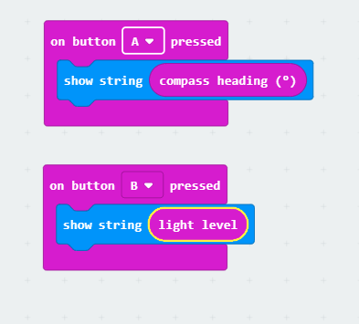

# BBC micro:bit


## Bag micro:bit

- "The Micro:bit Educational Foundation"
  - Fra 2015
  - None profit
  - "Our vision is to inspire every child to create their best digital future"
  - Stiftere/bidragsgivere
    - BBC
    - ARM
    - Microsoft
    - Amazon
    - British Counsil
- Se [https://microbit.org](https://microbit.org)
- BBC micro:bit har rødder tilbage til [BBC Micro](https://en.wikipedia.org/wiki/BBC_Micro) fra 80'erne 

## Hvad er en BBC micro:bit

- Lille simpel microcontroller baseret på en 16 MHz 32bit ARM Cortex-M0 processor med 256 KB Flash og 16 KB RAM. Alt hardware er open source.
  - 25 LED
  - To knapper
  - Accelerometer (acceleration)
  - Magnetometer (kompas)
  - Temperaturføler
  - Lysføler
  - Bluetooth / Radio
  - USB
  - 25 I/O porte til forskellige eksterne komponenter
    - Sensorer 
      - Temperatur
      - Fugtighed
      - Lyd      
    - Motorer
    - Relæer
    - Låse
    - Lamper
    - mv
    
## Programmering


- Kan programmeres på mange måde men typisk bruges enten 
  - [MakeCode (eller JavaScript)](https://makecode.microbit.org/) - link til online MS MakeCode Editor (dansk)
  - [Python](https://python.microbit.org/v/2.0) - link til online Python editor
- Men der findes [mange andre muligheder](https://en.wikipedia.org/wiki/Micro_Bit#Software) - herunder C++, Rust, MatLab, BASIC, Assembler og mange flere

### Eksempel på MakeCode



### Eksempel på JavaScript

```
input.onButtonPressed(Button.A, function () {
    basic.showString("" + input.compassHeading())
})
input.onButtonPressed(Button.B, function () {
    basic.showString("" + input.lightLevel())
})
```


### Eksempel på Python

```
from microbit import *


# Start calibrating
compass.calibrate()

# Try to keep the needle pointed in (roughly) the correct direction
while True:
    sleep(100)
    needle = ((15 - compass.heading()) // 30) % 12
    display.show(Image.ALL_CLOCKS[needle])
```

## Dokumentation

- Der findes masser af dokumentation 
  - [https://microbit.org/guide/quick/](https://microbit.org/guide/quick/) - engelsk (og andre sprog)
  - [DR artikel om Micro:bit](https://www.dr.dk/om-dr/om-bbc-microbit)
  - [https://www.dr.dk/skole/ultrabit](https://www.dr.dk/skole/ultrabit) - dansk

## Køb i Danmark

- Enheden (i flere pakker) kan købes mange steder i Danmark. Den kaldes typisk for Micro:Bit eller Ultra:Bit. Den findes både som et enkelt board (ca kr. 100-150), en lille pakke med usb kabel og batteri (den vil jeg anbefale - ca kr 180) eller som et "startsæt" med forskelligt tilbehør (ca. kr. 200-300). 
  - [Diverse pakker hos RasberryPi](https://raspberrypi.dk/webshop/kategori/micro-bit-tilbehoer-kits/)  
  - [Pakke branded med DR:Ultra hos ProShop](https://www.proshop.dk/Leg-Laering/DR-ultrabit-Start-kit/2681151)
  - ["gave pakke" hos ArduinoShoppen](https://arduinoshoppen.dk/produkt/bbc-microbit-board-inkl-batteriholder-usb-kabel/)
  - [Den store pakke hos BR](https://www.br.dk/legetoej/byggesaet/ultra-kodningssaet-ultra-bit/p/100411423?gclid=Cj0KCQiAoIPvBRDgARIsAHsCw080h-4DJl9ctMNLWMz4Nf-HFNZjllAgIuSMIBkPRjUjxBZcCnmTLREaAtWhEALw_wcB)  
  - [Den store pakke hos Bilka](https://www.bilka.dk/legetoej/konstruktionslegetoej/byggesaet/ultra-kodningssaet-ultra-bit/p/100411423) 

Den kan også fås mange andre steder, men jeg kan anbefale køb hos Rasberrypi.dk 

## Dette site

- Find dette site på **[https://devcronberg.github.io/st](https://devcronberg.github.io/st)** ([slide](https://docs.google.com/presentation/d/e/2PACX-1vSYJmr48OWY-MgXNIX2ZkcIbSke84ydsq8je4NwNrTjGohP1BOJPNWiHZpf01OZ3hsnnxhkxeLnqC47/pub?start=true&loop=false&delayms=3000))

## Om Michell

- Michell Cronberg
  - michell@cronberg.dk
  
  
