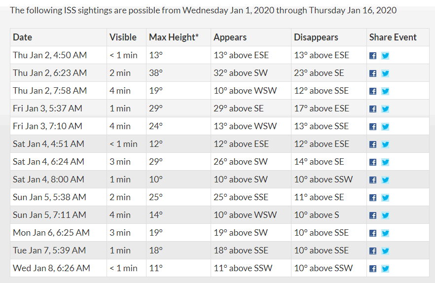
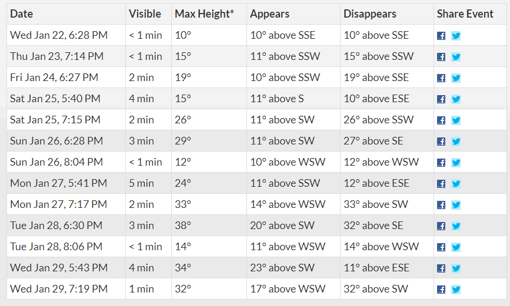

# Stjernehimlen i januar 2020

I Januar 2020 er der forskellige spændende muligheder for at se elementer i det univers vi alle er en del af. Ta' ungerne og resten af familien med ud og bliv overvældet - det kræver ikke andet end varmt tøj og lidt timning. Vinteren kan være træls på mange måde, men det bliver tidligt mørkt og sent lyst, og det giver gode bestingelser for at se op og ud.

  
Stjerneskud

D. 4 januar efter midnat vil den årligt tilbagevendende meteorsværm Kvadrantiderne give en del stjerneskud - 100-200 i timen. De vil have udgangspunkt omkring karlsvognen.

[Billedet er fra videnskab.dk](https://videnskab.dk/teknologi-innovation/kig-op-i-januar-reklameskilte-i-rummet-og-paa-maanen-er-kommet-taettere-paa)
  

  
Planeter

[Billede er fra WikiPedia](https://en.wikipedia.org/wiki/File:Solar-System.pdf)

### Venus

Venus er synlig på et rigtig godt tidspunkt fordi den står op om formiddagen og går ned omkring kl. 19 - så i ulvetimen lige før aftensmad er den meget synlig (mest synlige objekt på himlen efter månen).

[Billedet er fra TimeAndDate](https://www.timeanddate.com/astronomy/night/denmark/copenhagen)

Du vil ikke være i tvivl for det er typisk det eneste objekt på himlen udover månen. Det ligner en stjerne men er altså Venus. Du kan finde den ved at finde månen (øst-sydøst), og kigge til højre (syd-sydvest). Det bedste tispunkt er omkring 17.

#### Kort om Venus

[Billedet er fra WikiPedia](https://commons.wikimedia.org/w/index.php?search=venus&title=Special%3ASearch&go=Go&ns0=1&ns6=1&ns12=1&ns14=1&ns100=1&ns106=1#/media/File:Venus_globe.jpg)

- Placeret mellem solen og jorden
  - ca 108.000.000 km fra solen (jorden er ca 150.000.000 km fra solen)
    - ca 50 år med 100 km/t
- Nogenlunde samme størrelse som jorden
- Dækket af et skylag (der reflekterer solen) bestående af svovlsyre
- Meget varm overflade (ca 450 grader) og et kraftig atmosfærisk tryk
- Vi har haft 13 sonder på planeten men kun få har overlevet lang tid nok til at sende data og billeder
  - [Venera](https://en.wikipedia.org/wiki/Venera)
  

[Billede fra Venera sonder bearbejdet af Ted Stryk](http://planetimages.blogspot.com/2015/03/venus-from-33-years-ago-and-why-we-need.html)

### Mars

Mars er ligeledes synlig med det blotte øje men i modsætning til Venus skal den ses om morgenen - bedst omkring kl. 7

[Billedet er fra TimeAndDate](https://www.timeanddate.com/astronomy/night/denmark/copenhagen)

Den kan ses som et rødt lysende objekt i syd-sydøst.

#### Kort om Mars

[Billedet er fra WikiPedia](https://commons.wikimedia.org/wiki/Mars#/media/File:Mars_transparent.png)

- Placeret efter jorden
  - ca 250.000.000 km fra solen +/- (jorden er ca 150.000.000 km fra solen +/-)
    - 100 år med 100 km/t
- Størrelsen er omkring 50% af jorden
- Tyngdekraft ca 1/3 af jordens
- Temperatur på overfladen er i gns -60 grader (min -140 max 20)
- Næsten ingen atmosfære
- Masser af ekspeditioner til Mars
  - pt 2 robotbiler og flere laboratorier i kredsløb
  - en masse snak om kommende misioner til Mars - med både robotter og mennesker
    - [Mars 2020](https://www.jpl.nasa.gov/missions/mars-2020/)
    - SpaceX / Elon Musk vil sende mennesker til Mars i 2024
    - Se "Mars" på Netflix (link til [NetFlix](https://www.netflix.com/search?q=mars))
      - 2 sæsoner (12 afsnit)
    

[Billedet er fra NASA](https://www.nasa.gov/)

  
ISS

ISS (International Space Station) er altid et spændende syn, og bevæger sig hurtigt hen over himlen. Den er i kredsløb omkring 400 km over jorden med en fart af omkring 27.000 km/timen, og har dermed en solopgang/nedgang ca hver 1.5 time. ISS er fra 1998 og har pt 6 astronauter om bord.

[Billedet er fra NASA](https://www.nasa.gov/)

ISS kan ses i starten af Januar i nogle minutter om morgenen og sikkert også senere på måneden. Følg med på "Spot the station" fra NASA.

### Links relateret til ISS

- [ISS Live](https://www.nasa.gov/multimedia/nasatv/iss_ustream.html)
- [Spot the station](https://spotthestation.nasa.gov/sightings/view.cfm?country=Denmark&region=None&city=Frederiksberg#.Xg4TYkf0mUk)

  
Andre nyheder og spændende ting

  - 19/01 [SpaceX Crew Dragon In-Flight Falcon 9 Abort Test](https://www.youtube.com/watch?v=ARIZnaMXTEU)
  

[Ref](https://www.space.com/spacex-crew-dragon-in-flight-abort-test-photos.html)

  
Generelle links

- Find dette site på **[https://devcronberg.github.io/st](https://devcronberg.github.io/st)** ([slide](https://docs.google.com/presentation/d/e/2PACX-1vSYJmr48OWY-MgXNIX2ZkcIbSke84ydsq8je4NwNrTjGohP1BOJPNWiHZpf01OZ3hsnnxhkxeLnqC47/pub?start=true&loop=false&delayms=3000))
- [Planetarium](https://planetarium.dk/)
- [Diverse applikationer til tlf/tablet](https://www.makeuseof.com/tag/great-android-astronomy-apps/)
- [Fortællingen om universet af Tina Ipsen](https://www.pricerunner.dk/pl/802-2001729696/Boeger/Fortaellingen-om-Universet-Fra-Big-Bang-til-mennesket-i-dag-(E-bog-2019)-Sammenlign-Priser)
## Om Michell

- Michell Cronberg er instruktør og konsulent på Teknologisk Institut
  - michell@cronberg.dk

